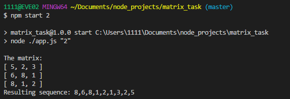

## Matrix snail runner

### The task

Take the n, create the (2n-1)x(2n-1) matrix, filled with random values. 
Then output those values in a row, beginning from the center and going in spiral: left, down, right, up and so on. 
Solution should work for any n.

### Example:

For the matrix:

| 1 | 2 | 3 |
|---|---|---|
| 4 | 5 | 6 |
| 7 | 8 | 9 |

Result should be: `5 4 7 8 9 6 3 2 1`

### Usage:

npm start [`n`]

